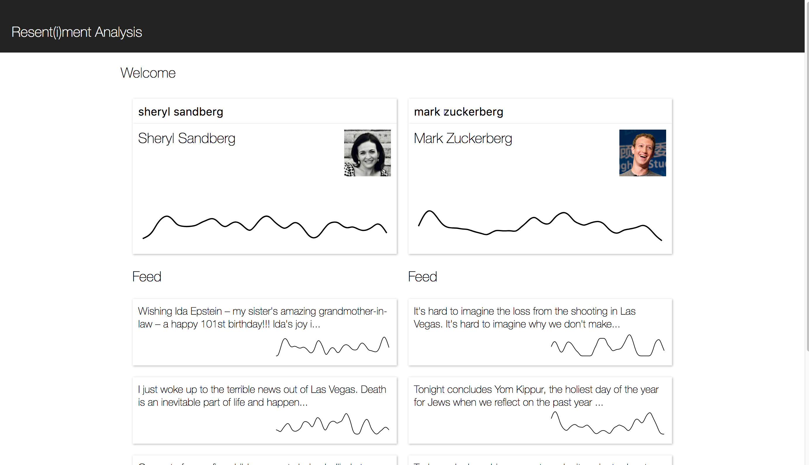

# Resent(i)ment Analysis (HackMIT 2017)

## Overview
[Devpost](https://devpost.com/software/news-sentiment)

(Screenshot generated using mock data)

Virtually no one would disagree with the claim that our nation has become more ideologically divided in recent years, and the idea that this division has led to more inflammatory discourse on the internet is equally uncontroversial. What may be less apparent to many people is the way that public figures--journalists, politicians, celebrities--have become a target of increasingly rancorous speech, as well as the ways in which some demographics are more at risk of this kind of harassment than others. 

With this project, we seek to make it trivially easy for an online activist to point out abusive behavior, especially when it manifests itself in a biased way. Using [Baidu's Paddle deep learning framework](https://github.com/PaddlePaddle), we trained a sentiment analyzer on [public Wikipedia datasets on personal attacks and aggression in online dialogue](https://figshare.com/projects/Wikipedia_Talk/16731). We then developed a webapp to allow users to infer the presence of strongly positive or negative language on the Facebook profiles of public figures. 

## Technical breakdown
### Paddle
The code for training our Paddle sentiment analysis model can be found in `server/train.ipynb`. Much of the code is adapted from the open-source [PaddlePaddle book](https://github.com/PaddlePaddle/book/tree/develop/06.understand_sentiment), although we did significant work (with the support of Baidu engineers over Slack during HackMIT) to be able to train the model ourselves on the Wikipedia datasets as well as modify the neural network architecture to output a sentiment 'rating' rather than a binary classification. 

After training the model on an AWS instance separate from our server setup, we copied over the topology and parameter files and set up an inference server that could be easily accessed by our web backend. Again, we consulted the [PaddlePaddle book section on using pre-trained models](https://github.com/PaddlePaddle/book/wiki/Using-Pre-trained-Models#3-sentiment-classification). 

### Webapp
We implemented an interactive data visualization webapp to explore the results of our sentiment analysis. The frontend was built using React using vanilla CSS and JS, with graphical visualizations implemented in D3. The interface contains two text boxes which can be used to search for two public figures to compare. After typing in a name, the webapp queries our server, which then searches Facebook for matching pages. The user can then select a result for analysis.

Our server then loops through the most recent posts by the page, retrieving a large batch of top comments for each post, as sorted by Facebook's comment ranking algorithm. Each comment is fed through our sentiment analysis server over its HTTP endpoint and given a score. These individual scores, for all fetched comments on all fetched posts, are then returned back to the client.

On the frontend, we collect all comment scores for each given post and display them in a smoothed histogram. We use [kernel density estimation](https://bl.ocks.org/mbostock/4341954) to produce a smooth line representing the distribution of sentiment scores and render this using D3.

We found that the standard Facebook Graph API was too limited for the analysis we intended to do. It was unable to return posts and comments, even when public, from many prominent pages. To circumvent this issue, we implemented a scraper which instead retrieves the data page-by-page from the Facebook mobile website. While this method was able to successfully retrieve the data we needed, it remains inefficient and slow to run.
